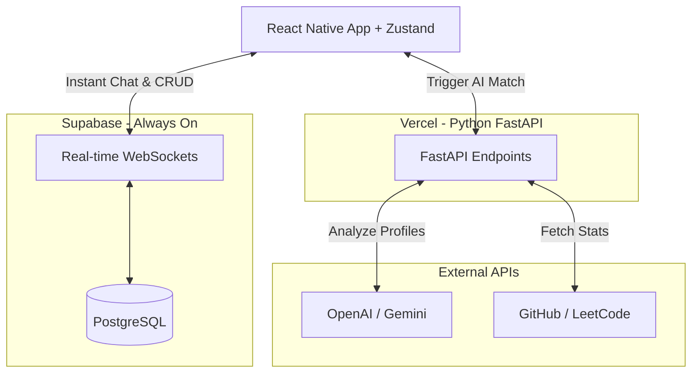

# Joinr - Developer Matchmaking Platform

## 📌 Project Overview
"Joinr" is a comprehensive mobile application designed to connect developers, designers, and engineers. It goes beyond a simple "Tinder for developers" by acting as a verifiable Developer Identity platform. By combining manual data entry with live data from GitHub and LeetCode, utilizing AI for compatibility matching, and offering a robust real-time chat, this app serves as the ultimate networking tool for side projects and hackathons.

---

## 🚀 Core Features

### 1. The "Dev Resume" (Manual + Automated Data)
Lowers the barrier to entry by allowing manual profile creation, but gamifies the experience with a **Trust/Authenticity Score** for linking external APIs:
*   **Manual Entry:** Basic bio, roles (e.g., UI Designer, Backend Dev).
*   **GitHub Integration:** Fetches top languages, contribution graphs, and repos.
*   **LeetCode Integration:** Displays problem-solving stats and contest ratings.

### 2. AI Compatibility Score (Filter-First JIT Workflow) 🧠
Highly optimized AI matching to save API costs:
1. User filters by hard criteria via standard SQL (e.g., "Need a React Developer").
2. The Python FastAPI backend uses an LLM to analyze the profiles of the filtered subset *Just-In-Time*.
3. The 0-100 score and 1-sentence reasoning is cached in the database for instant future loading.

### 3. Hackathon Team Builder Mode ⏱️
A dedicated toggle for users urgently seeking teams for upcoming events.

### 4. Micro-Bounties 🎯
A community bulletin board where developers can post specific, granular tasks they need help with (e.g., "Need a Regex expert"). 

### 5. Collaboration Announcements & Projects 🤝
When two users officially agree to work together, they can create a "Project Workspace." This triggers a social announcement to their followers: *"🚀 User A and User B have teamed up to build [Project Name]"*, fostering a lively community feed without spamming GitHub commits.

### 6. Secure Real-Time Chat 💬
Fully functioning, instant end-to-end messaging powered entirely by Supabase Realtime (WebSockets).

---

## 🗺️ User Journey (UX Flow)
To ensure a seamless, professional experience, the app follows a strict, highly optimized user flow:

### 1. Onboarding & Verification
*   **Multi-Step Wizard:** Users sign up via Email/Password, fill out a basic manual bio, and are then heavily incentivized to link their GitHub/LeetCode.
*   **Trust Score:** Skipping the GitHub link is allowed (lowering the barrier to entry), but linking it grants a glowing "Verified Developer" Trust Score.

### 2. Setting Intent (The Status System)
Users must declare their current goal to ensure accurate matchmaking. They choose between:
*   **"Looking to Join"** (Open to Work).
*   **"Recruiting"** (Requires them to attach a brief pitch for their idea).

### 3. Discovery (The Feed)
*   **Vertical Scrolling Cards:** Instead of blind Tinder-style swiping, users browse a vertical feed of profile cards (like LinkedIn).
*   **AI Match Visibility:** Each card prominently displays the JIT AI Compatibility Score.
*   **Initiating Contact:** Users click a "Connect" button on the side of a card to send an introductory message (e.g., *"Hey, let's build this!"*), which triggers an instant push notification for the receiver.

### 4. Closing the Loop (Project Formation)
*   **"Form Team" Action:** When two users agree to work together in the chat, one clicks a "Propose Team" button. 
*   **Collaboration Announcement:** Accepting this triggers a social post to the community feed: *"🚀 User A and B are building [Project]"*.
*   **Multi-Project Support:** The app adds a "Current Project" badge to their profiles, but allows them to keep their "Open to Work" status active if they wish to juggle multiple projects.

---

## 🏗️ System Architecture & Tech Stack

### The "Forever Free" Scalable Stack
*   **Frontend (React Native / Expo):** Exportable as a Web PWA or native mobile app, utilizing **Zustand** for strict, clean-architecture state management.
*   **Database & Chat (Supabase):** Provides managed PostgreSQL and handles WebSocket connections natively.
*   **Backend API & AI (Python/FastAPI):** Hosted on Vercel as Serverless Functions to prevent sleeping while costing $0.

### Architecture Flow

---

## 🗄️ Normalized Database Schema (PostgreSQL)

To ensure queries remain fast and clean, data is strictly separated:
*   **`users`**: `id`, `email`, `name`, `manual_bio`, `created_at`
*   **`developer_metrics`**: `user_id`, `trust_score`, `github_json`, `leetcode_json`
*   **`projects`**: `id`, `title`, `description`, `status`
*   **`project_members`**: `project_id`, `user_id`, `role`
*   **`matches`**: `id`, `user_a_id`, `user_b_id`, `ai_match_score`, `ai_reasoning`
*   **`messages`**: `id`, `match_id`, `sender_id`, `text`, `created_at`
*   **`bounties`**: `id`, `creator_id`, `title`, `description`, `is_resolved`

---

## 🛣️ Next Steps
1. **Database Schema Setup:** Write the `.sql` file to create these tables in Supabase with proper Foreign Keys and Row Level Security.
2. **Initialize React Native:** Create the Expo project with the Zustand folder structure.
3. **Initialize FastAPI:** Create the Python backend for the AI integration.
